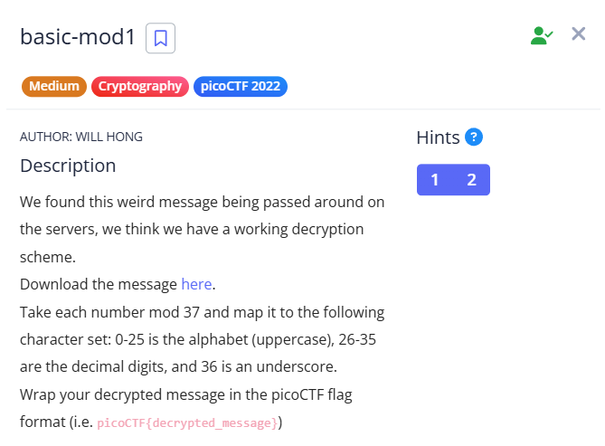

# Basic-mod1 

### Challenge 



**Given message :** `128 322 353 235 336 73 198 332 202 285 57 87 262 221 218 405 335 101 256 227 112 140`

### Solution 

For the description given in the challenge , wrote a python script that decrypts the Message 

```python 
numbers = [128, 322, 353, 235, 336, 73, 198, 332, 202, 285, 57, 87, 262, 221, 218, 405, 335, 101, 256, 227, 112, 140]

def decrypt_message(numbers):
    decrypted_chars = []
    for num in numbers:
        mod_value = num % 37
        if 0 <= mod_value <= 25:
            decrypted_chars.append(chr(ord('A') + mod_value))
        elif 26 <= mod_value <= 35:
            decrypted_chars.append(str(mod_value - 26))
        elif mod_value == 36:
            decrypted_chars.append('_')
    return "".join(decrypted_chars)

decrypted_message = decrypt_message(numbers)
flag = f"picoCTF{{{decrypted_message}}}"
print(flag)
```

By running this code I got the flag `picoCTF{R0UND_N_R0UND_79C18FB3}` .

