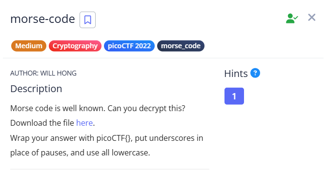
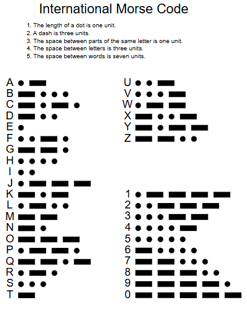

# Morse Code 

## Challenge 

Here in this challenge I was given by a Audio file , you can have it from the website .

**What is Morse code ?**

`Morse code` is a communication system that encodes text characters (letters, numbers, and punctuation) into standardized sequences of two different signal durations: `dots` (short signals, also called `dits`) and `dashes` (long signals, also called "`dahs`"). It was originally developed in the 1830s by Samuel Morse and Alfred Vail for use with the electrical telegraph.

The key to Morse code lies in its rhythmic structure and precise timing:

Dot (dit): A short signal.
Dash (dah): A long signal, ideally three times the duration of a dot.
Space between dits and dahs within a character: Equal to one dot duration.
Space between characters (letters/numbers) within a word: Equal to three dot durations.
Space between words: Equal to seven dot durations.
This system allows for communication through various mediums by simply turning a signal "on" or "off" for varying durations.

**Chart of the Morse code , 26 letters and 10 numerals**

## Solution 

Since it is an Audio File , I went for a online tool 

**TOOl LINK** : [https://morsefm.com/](https://morsefm.com/)

There I uploaded the file , and got the text `WH47 H47H 90D W20U9H7` 

As the description of the Challenge says that ` put underscores in place of pauses, and use all lowercase ` , The Flag is 

`picoCTF{wh47_h47h_90d_w20u9h7}`