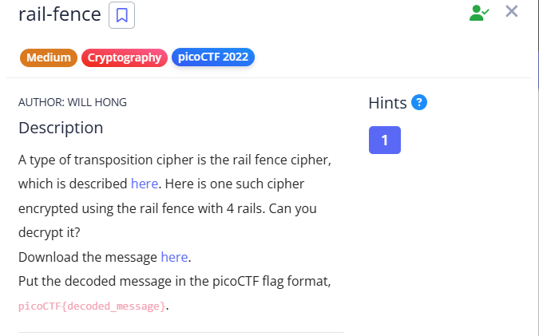

# Rail - Fence 

### challenge 



**Given Message** : `Ta _7N6D8Dhlg:W3D_H3C31N__387ef sHR053F38N43DFD i33___N6`

As it is in the description of  the challenge , the message is scrambled using the technique or method called `Rail-fence` also called zigzag cipher . 

## What is the Rail-Fence cipher ?

The `Rail Fence Cipher` is a classic example of a `transposition cipher`. This means that instead of substituting letters for other letters (like in a Caesar cipher), it rearranges the original letters of the plaintext to create the `ciphertext`. It gets its name from the way the text is written, resembling a `zig-zag pattern` along the `rails` of a fence.

The `key` for the Rail Fence cipher is the `number of rails used for encryption`.

## How it works

**Encryption**

In the `rail fence cipher`, the `plaintext` is written downwards diagonally on successive `rails` of an imaginary fence, then moving up when the bottom rail is reached, down again when the top rail is reached, and so on until the whole plaintext is written out. The `ciphertext` is then read off in rows

For example, to encrypt the message 'HELLO WORLD' with 3 "rails", write the text as:

```text
H . . . O . . . L . . .
. E . L . W . R . D .
. . L . . . O . . .
```

**Decryption** 

To Decrypt the Rail Fence Cipher :
- Arrange rails as same as while encrypting ( no. of rows = rails/key  ) .

- Number Columns should be equal to the length of the `Cipher text` in each row / rail .

- Place some place holder where you can fill the cipher letter in the rails . (like encrypting , placeholders should place diagonally) .

- Now replace the place holder with the cipher letter  and it should be done as row after row (means replace all the place holders in the first row then move to the  next)

- Read the text diagonally ,` The PlainText `.

## Solution 

```text 

Given cipher text  : Ta _7N6D8Dhlg:W3D_H3C31N__387ef sHR053F38N43DFD i33___N6

Number of rails : 4 


* _ _ _ _ _ * _ _ _ _ _ * _ _ _ _ _ * _ _ _ _ _ * _ _ _ _ _ * _ _ _ _ _ * _ _ _ _ _ * _ _ _ _ _ * _ _ _ _ _ * _
_ * _ _ _ * _ * _ _ _ * _ * _ _ _ * _ * _ _ _ * _ * _ _ _ * _ * _ _ _ * _ * _ _ _ * _ * _ _ _ * _ * _ _ _ * _ *
_ _ * _ * _ _ _ * _ * _ _ _ * _ * _ _ _ * _ * _ _ _ * _ * _ _ _ * _ * _ _ _ * _ * _ _ _ * _ * _ _ _ * _ * _ _ _
_ _ _ * _ _ _ _ _ * _ _ _ _ _ * _ _ _ _ _ * _ _ _ _ _ * _ _ _ _ _ * _ _ _ _ _ * _ _ _ _ _ * _ _ _ _ _ * _ _ _ _


T _ _ _ _ _ a _ _ _ _ _ $ _ _ _ _ _ * _ _ _ _ _ 7 _ _ _ _ _ N _ _ _ _ _ 6 _ _ _ _ _ D _ _ _ _ _ 8 _ _ _ _ _ D _
_ h _ _ _ l _ g _ _ _ : _ W _ _ _ 3 _ D _ _ _ * _ H _ _ _ 3 _ C _ _ _ 3 _ 1 _ _ _ N _ * _ _ _ * _ 3 _ _ _ 8 _ 7
_ _ e _ f _ _ _ $ _ s _ _ _ H _ R _ _ _ 0 _ 5 _ _ _ 3 _ F _ _ _ 3 _ 8 _ _ _ N _ 4 _ _ _ 3 _ D _ _ _ F _ D _ _ _
_ _ _ $ _ _ _ _ _ i _ _ _ _ _ 3 _ _ _ _ _ 3 _ _ _ _ _ * _ _ _ _ _ * _ _ _ _ _ * _ _ _ _ _ N _ _ _ _ _ 6 _ _ _ _


So , the TEXT is :


The flag is: WH3R3_D035_7H3_F3NC3_8361N_4ND_3ND_83F6D8D7

NOTE : $ - space 
       * - hiphen

```

So the **FLAG** is ,  is `picoCTF{WH3R3_D035_7H3_F3NC3_8361N_4ND_3ND_83F6D8D7}`
